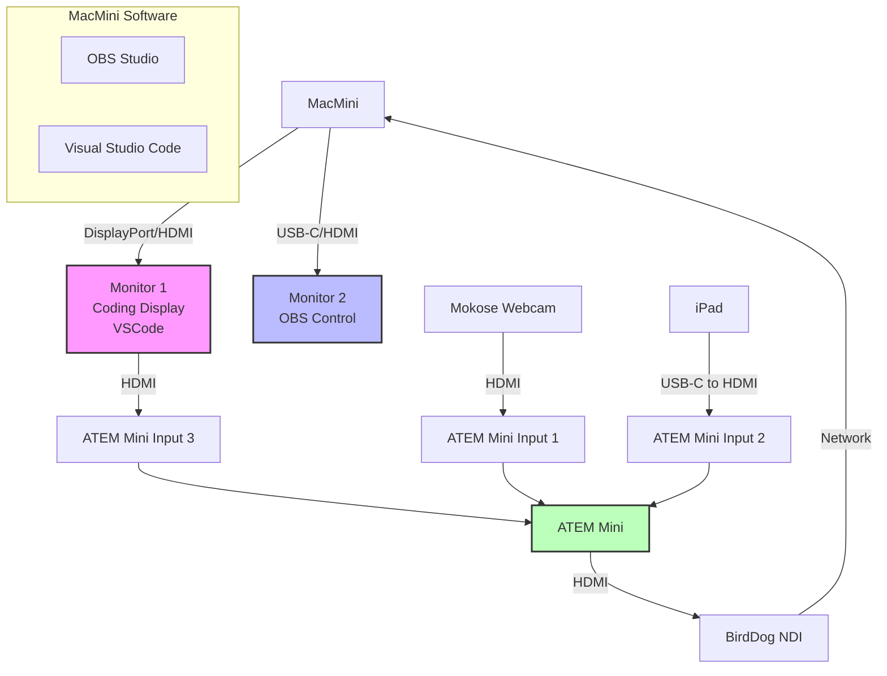

# 1400 - Refactorings

Let me clarify how to connect and configure your monitors in this setup.

Here's the step-by-step setup:

1. **Physical Monitor Setup**
   - Connect Monitor 1 (Coding Display) to MacMini using DisplayPort/HDMI
   - Connect Monitor 2 (OBS Control) to MacMini using USB-C/HDMI
   - Connect Monitor 1's HDMI output to ATEM Mini Input 3

2. **MacMini Display Configuration**
   ```
   System Settings → Displays:
   - Arrange monitors in logical order
   - Set Monitor 1 as your main display
   - Set both monitors to 1080p resolution
   ```

3. **ATEM Mini Connections**
   ```
   Current Setup:
   Input 1: Mokose Webcam
   Input 2: iPad
   Input 3: Coding Monitor (Monitor 1)
   ```

4. **OBS Display Capture Setup**
   ```
   1. Add Source → Display Capture
   2. Properties:
      - Display: Select "Monitor 1"
      - Resolution: 1920x1080
      - Frame Rate: 60
   ```

5. **Visual Studio Code Setup**
   ```
   1. Launch VSCode
   2. Move to Monitor 1
   3. Window → Enter Full Screen
   4. Settings adjustments for streaming:
      - Editor Font Size: 14-16
      - Integrated Terminal Font Size: 14
      - Minimap: Disabled
      - High Contrast Theme
   ```

Key Benefits of This Setup:
1. Dedicated coding monitor that's captured by ATEM
2. Separate OBS control monitor for managing scenes
3. Clean HDMI signal from coding monitor to ATEM

Common Issues and Solutions:

1. **Monitor Not Detected**
   ```
   Check:
   - Cable connections
   - Monitor input source
   - MacMini display settings
   ```

2. **Display Capture Black Screen**
   ```
   Fix:
   - Restart OBS
   - Verify monitor selection
   - Check ATEM input settings
   ```

3. **Resolution Mismatch**
   ```
   Ensure:
   - All devices set to 1080p
   - ATEM input format matches
   - OBS canvas matches resolution
   ```

Would you like me to:
1. Provide specific monitor layout recommendations?
2. Explain how to handle different monitor resolutions?
3. Show how to set up monitor-specific scene compositions?




