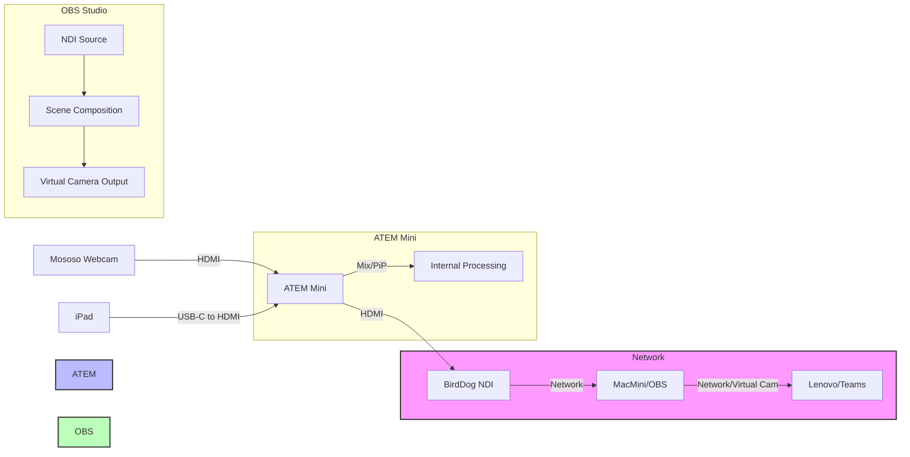
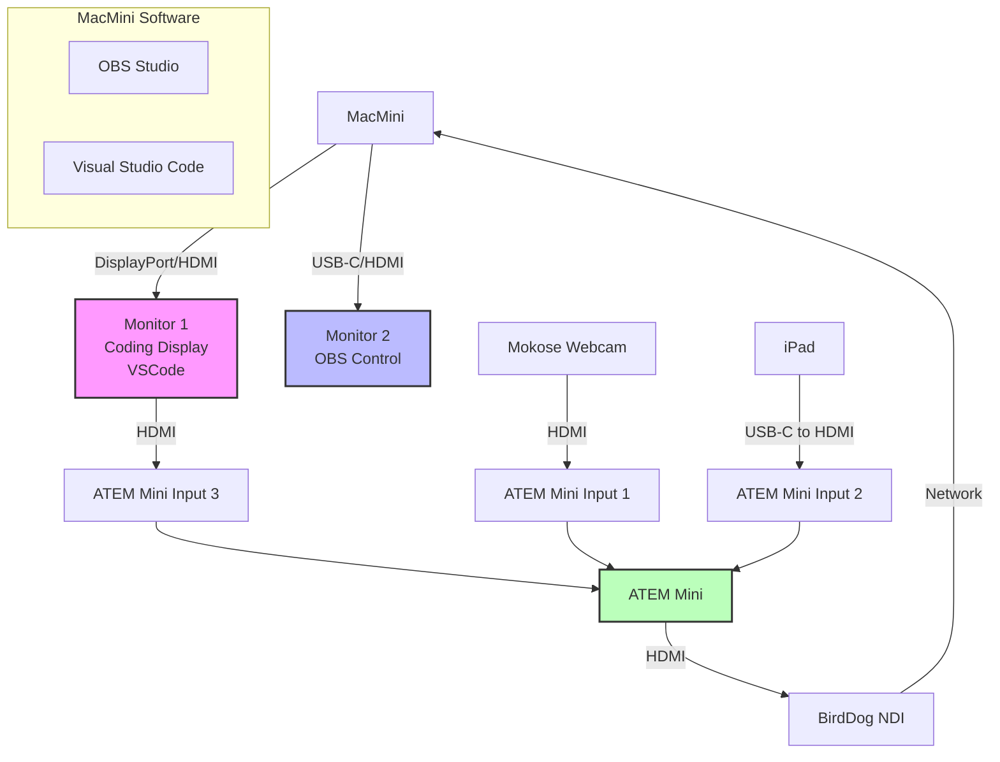

# 1400 - Refactorings

I'll create a detailed diagram of the setup and provide specific configuration steps.

Detailed Configuration Steps:

1. ATEM Mini Setup:
   - Power on ATEM Mini
   - Connect to ATEM Software Control on MacMini
   - Configure inputs:
     * Input 1: Set to HDMI (Webcam)
     * Input 2: Set to HDMI (iPad)
   - Set up Picture-in-Picture:
     * Press "Picture in Picture" button on ATEM Mini
     * Use software control to position iPad overlay
     * Use "Picture in Picture Position" buttons for quick presets

2. BirdDog NDI Setup:
   - Connect BirdDog to network via Ethernet
   - Access BirdDog web interface (find IP through BirdDog Central)
   - Configure:
     * Set video format to match ATEM output (likely 1080p60)
     * Enable NDI output
     * Note down the NDI stream name

3. OBS Studio Setup on MacMini:
   ```
   a. Add NDI Source:
      - Click '+' in Sources
      - Select 'NDI Source'
      - Choose your BirdDog stream from dropdown
      - Set Resolution to match source (1080p)

   b. Configure Virtual Camera:
      - Tools → VirtualCamera
      - Start Virtual Camera
      - Set output resolution to 1080p
   ```

4. Teams Setup on Lenovo:
   ```
   a. Open Teams Settings:
      - Click profile picture → Settings
      - Select Devices
      - Under Camera, choose 'OBS Virtual Camera'
      - Test video to confirm setup

   b. Additional Teams Settings:
      - Enable hardware acceleration
      - Set maximum incoming video quality
   ```

5. iPad Settings:
   - Set display output to mirror
   - Resolution to 1080p
   - Use drawing app of choice (Procreate, Notes, etc.)

Operation Tips:
1. Always test the setup before important meetings
2. Use ATEM Mini's preview feature to check overlay position
3. Have preset positions saved for common overlay layouts
4. Monitor CPU usage on MacMini to ensure smooth performance

Common Troubleshooting:
- If no NDI signal: Check network connections and BirdDog settings
- If video lag: Reduce resolution or frame rate in OBS
- If iPad not detected: Try disconnecting/reconnecting HDMI
- If Teams can't see camera: Restart OBS Virtual Camera

Would you like me to expand on any of these aspects? For example, I could provide more specific ATEM Mini transition settings or OBS scene composition recommendations.



I'll provide detailed ATEM Mini transition settings and OBS scene composition recommendations for optimal streaming quality.


# ATEM Mini Advanced Settings Guide

## 1. ATEM Mini Transition Settings

### Main Program Mix Settings
- Transition Rate: 0.5-1 second (smooth but not too slow)
- Mix Effect 1 Settings:
  * Background Color: Neutral Gray (#7F7F7F)
  * Auto Transition: Enable
  * Cut Bus Mode: Disable (for smoother transitions)

### Picture-in-Picture (PiP) Presets
1. **Corner Overlay** (Best for iPad annotations)
   - Position: Top Right
   - Size: 25% of screen
   - Crop: None
   - Border: 1px white
   - Shadow: Soft, 20% opacity

2. **Side-by-Side** (For equal emphasis)
   - Position: Split screen
   - Size: 50/50
   - Border: None
   - Gap: 10px

3. **Focus Mode** (For detailed iPad work)
   - Position: Main screen
   - Size: 75% of screen
   - Webcam: 25% bottom right

### Advanced ATEM Settings
- Audio Delay: 1-2 frames
- Input Frame Sync: Enabled
- Multi View Layout: 2x2
- Camera Control:
  * Sharpness: +15
  * Auto Focus: Enabled
  * Auto Gain: Enabled

## 2. OBS Scene Compositions

### Scene 1: Professional Presentation
```
Layout Hierarchy:
1. Background (1920x1080 neutral gradient)
2. Webcam Feed (16:9 aspect ratio)
3. iPad Overlay
4. Lower Third Banner (optional)
```

### Scene 2: Interactive Teaching
```
Layout Hierarchy:
1. iPad Feed (Main display)
2. Webcam (Picture-in-Picture)
3. Custom Frame
4. Status Indicators
```

### Scene 3: Discussion Mode
```
Layout Hierarchy:
1. Split Screen Base
2. Webcam (Left)
3. iPad (Right)
4. Transition Overlays
```

## 3. OBS Advanced Settings

### Video Settings
- Base Resolution: 1920x1080
- Output Resolution: 1920x1080
- Downscale Filter: Lanczos (best quality)
- FPS: 60

### Advanced Settings
```
Process Priority: High
Video Memory: 2048 MB
Color Format: NV12
Color Space: 709
Color Range: Partial
```

### Recommended Filters
1. **Webcam Source:**
   - Noise Suppression
   - Color Correction
     * Gamma: 1.1
     * Contrast: 1.1
     * Brightness: 0.0
     * Saturation: 1.2

2. **iPad Source:**
   - Sharpness
     * Sharpness: 2
   - Color Correction
     * Saturation: 1.1
     * Gamma: 1.0

### NDI Source Settings
```
Sync: Network (low latency)
Hardware Acceleration: Enabled
Low Bandwidth Mode: Disabled
Buffer: 1-2 frames
```

## 4. Performance Optimization

### MacMini Resource Allocation
1. **CPU Priority:**
   - OBS Studio: High
   - ATEM Software: Above Normal
   - Other Applications: Normal

2. **Memory Allocation:**
   - Minimum 8GB free RAM
   - Virtual Memory: 2x RAM size

### Network Optimization
1. **QoS Settings:**
   - NDI Traffic: Priority
   - Port Forward: 5961-5964
   - MTU Size: 1500

2. **Bandwidth Requirements:**
   - Minimum Upload: 20 Mbps
   - Minimum Download: 20 Mbps
   - Latency: <50ms

## 5. Quick Action Shortcuts

### ATEM Mini Hardware Buttons
```
1: Full Webcam
2: Full iPad
3: PiP Preset 1
4: PiP Preset 2
```

### OBS Hotkeys
```
Alt + 1: Scene 1
Alt + 2: Scene 2
Alt + 3: Scene 3
Ctrl + Alt + 1: Toggle Webcam
Ctrl + Alt + 2: Toggle iPad
Space: Quick Source Switch
```

I've provided comprehensive settings for both ATEM Mini and OBS. A few key points to highlight:

1. The PiP presets are designed to be easily accessible during live streaming, allowing quick transitions between different views.

2. The OBS scenes are structured in layers for maximum flexibility while maintaining professional quality.

3. The performance settings are optimized for MacMini to ensure smooth operation.

Would you like me to:
1. Add more specific settings for your Mososo webcam?
2. Create additional scene presets for specific use cases?
3. Explain any of the technical settings in more detail?

I'll create a detailed guide for setting up an optimal OBS scene that maximizes the green screen functionality for your iPad drawings.

# Professional OBS Scene Setup with iPad Green Screen

## Initial Scene Creation

1. **Create Base Scene**
   ```
   1. Click '+' in Scenes panel
   2. Name it "Interactive Drawing Scene"
   3. Optional: Create scene collection named "iPad Overlay Setup"
   ```

2. **Add Sources in Order**
   ```
   Bottom → Top Layer Order:
   1. Background (optional)
   2. Webcam NDI Source
   3. iPad NDI Source
   4. Status Elements (optional)
   ```

## Detailed Source Configuration

### 1. Background (Optional)
```
Add → Color Source:
- Name: "Solid Background"
- Color: Dark Gray (#222222)
- Size: 1920x1080
```

### 2. Webcam NDI Source
```
Add → NDI Source:
- Name: "Main Camera"
- Source Name: [Your BirdDog Stream]
- Transform:
  * Right-click → Transform → Fit to Screen
  * Scale with CTRL+ALT for perfect 16:9

Filters to Add:
1. Color Correction
   - Saturation: 1.2
   - Contrast: 1.1
   - Brightness: -0.1
   - Gamma: 1.1

2. Sharpen
   - Sharpness: 0.3
```

### 3. iPad NDI Source
```
Add → NDI Source:
- Name: "iPad Drawing Layer"
- Source Name: [Your iPad Stream]
- Transform: Fit to Screen

Essential Filters (In Order):
1. Color Correction
   - Saturation: 1.0
   - Contrast: 1.1
   - Gamma: 1.0

2. Chroma Key
   - Key Color Type: Custom
   - Key Color: #00FF00
   - Similarity: 400
   - Smoothness: 80
   - Key Color Spill Reduction: 100
   - Opacity: 100
   - Edge Feather: 2

3. Sharpen
   - Sharpness: 0.2

4. GPU Delay (If needed)
   - Delay: 1-2 frames
```

## Advanced Filter Configurations

### Fine-Tuning Chroma Key
```
Additional Settings:
1. Transition Override
   - Transition: Fade
   - Duration: 300ms

2. Advanced Chroma Settings
   - View Type: Alpha Mask
   - Anti-Aliasing: Enabled
   - Edge Lighting: Disabled
```

### Color Correction for Perfect Blend
```
Add Color Grade Filter:
- Gamma: R:1.0, G:1.0, B:1.0
- Lift: R:0.0, G:0.0, B:0.0
- Saturation: 1.1
```

## Scene Variations

### 1. Full Screen Drawing
```
Transform iPad Source:
- Size: 1920x1080
- Position: 0,0
- Crop: None
```

### 2. Side Drawing Panel
```
Transform iPad Source:
- Size: 640x1080
- Position: Right
- Add Edge Fade Filter:
  * Edge: Left
  * Smoothness: 20px
```

### 3. Floating Drawing Window
```
Transform iPad Source:
- Size: 800x600
- Position: Top Right
- Add Round Corner Filter:
  * Corner Radius: 20
  * Feather: 2
```

## Additional Elements

### Status Indicators
```
Add Text Sources:
1. Drawing Mode Indicator
   - Font: Arial Bold
   - Size: 24px
   - Color: White
   - Position: Top-left

2. Color Palette Reference
   - Add Image Source
   - Size: 100x400
   - Position: Left edge
   - Opacity: 80%
```

## Performance Optimization

### Source Buffer Settings
```
For Both NDI Sources:
- Sync: Network
- Hardware Acceleration: Enabled
- Low Bandwidth Mode: Disabled
- Buffer: 1-2 frames
```

### Scene Buffer
```
Right-click scene → Properties:
- Buffer Size: 2 frames
- Enable Performance Mode
```

## Hotkeys Setup
```
Settings → Hotkeys:
1. Toggle iPad Source Visibility
   - Show: CTRL + I
   - Hide: CTRL + SHIFT + I

2. Switch Drawing Modes
   - Full Screen: CTRL + 1
   - Side Panel: CTRL + 2
   - Floating: CTRL + 3
```

## Quick Access Settings

### Scene Transitions
```
Add to Quick Controls:
1. iPad Source Opacity
2. Chroma Key Similarity
3. Smoothness Adjustment
```

### Source Dock
```
View → Docks → Add Custom Dock:
- Sources
- Audio Mixer
- Scene Transitions
```

## Testing Procedures

1. **Visual Check**
   ```
   Test with:
   - Different colors
   - Various stroke widths
   - Quick movements
   - Static drawings
   ```

2. **Performance Check**
   ```
   Monitor:
   - CPU Usage
   - Dropped Frames
   - NDI Performance
   ```

3. **Recording Test**
   ```
   Make short recordings to verify:
   - Transparency consistency
   - Color accuracy
   - Edge quality
   ```

Important Tips for Success:
1. Always test the chroma key with different drawing colors before going live
2. Keep your iPad brightness consistent
3. Consider creating a template in your drawing app with safe zones marked

Would you like me to:
1. Explain how to create specific drawing effects that work well with this setup?
2. Provide additional filter combinations for different drawing styles?
3. Show how to set up multiple scenes that share these sources?


Let me clarify how to connect and configure your monitors in this setup.

Here's the step-by-step setup:

1. **Physical Monitor Setup**
   - Connect Monitor 1 (Coding Display) to MacMini using DisplayPort/HDMI
   - Connect Monitor 2 (OBS Control) to MacMini using USB-C/HDMI
   - Connect Monitor 1's HDMI output to ATEM Mini Input 3

2. **MacMini Display Configuration**
   ```
   System Settings → Displays:
   - Arrange monitors in logical order
   - Set Monitor 1 as your main display
   - Set both monitors to 1080p resolution
   ```

3. **ATEM Mini Connections**
   ```
   Current Setup:
   Input 1: Mokose Webcam
   Input 2: iPad
   Input 3: Coding Monitor (Monitor 1)
   ```

4. **OBS Display Capture Setup**
   ```
   1. Add Source → Display Capture
   2. Properties:
      - Display: Select "Monitor 1"
      - Resolution: 1920x1080
      - Frame Rate: 60
   ```

5. **Visual Studio Code Setup**
   ```
   1. Launch VSCode
   2. Move to Monitor 1
   3. Window → Enter Full Screen
   4. Settings adjustments for streaming:
      - Editor Font Size: 14-16
      - Integrated Terminal Font Size: 14
      - Minimap: Disabled
      - High Contrast Theme
   ```

Key Benefits of This Setup:
1. Dedicated coding monitor that's captured by ATEM
2. Separate OBS control monitor for managing scenes
3. Clean HDMI signal from coding monitor to ATEM

Common Issues and Solutions:

1. **Monitor Not Detected**
   ```
   Check:
   - Cable connections
   - Monitor input source
   - MacMini display settings
   ```

2. **Display Capture Black Screen**
   ```
   Fix:
   - Restart OBS
   - Verify monitor selection
   - Check ATEM input settings
   ```

3. **Resolution Mismatch**
   ```
   Ensure:
   - All devices set to 1080p
   - ATEM input format matches
   - OBS canvas matches resolution
   ```

Would you like me to:
1. Provide specific monitor layout recommendations?
2. Explain how to handle different monitor resolutions?
3. Show how to set up monitor-specific scene compositions?




I'll create a detailed guide for setting up monitor-specific scene compositions in OBS that work well with your multi-monitor setup.

# Monitor-Specific OBS Scene Compositions

## Base Scenes Configuration

### 1. Full Code Scene
```
Name: "Code Full"
Sources (Bottom to Top):
1. Background
   - Color: #1E1E1E (VSCode dark theme)
   - Size: 1920x1080

2. Display Capture (Monitor 1)
   - Capture Settings:
     * Display: Monitor 1 (Coding Display)
     * Method: Windows Graphics Capture
   - Transform:
     * Resize to 1920x1080
     * Position: Center
   
3. Camera Small
   - Size: 320x180
   - Position: Bottom Right
   - Filters:
     * Round Corners: 10px
     * Border: 2px white

Layout Properties:
- No dead zones
- Terminal visible
- File explorer accessible
```

### 2. Split Code and Webcam
```
Name: "Code Split"
Sources:
1. Display Capture (Monitor 1)
   - Transform:
     * Size: 1280x1080
     * Position: Left
   - Crop:
     * Left: 0
     * Right: Adjust to hide unnecessary UI

2. Webcam
   - Transform:
     * Size: 640x1080
     * Position: Right
   - Filters:
     * Border: Left only, 2px white
```

### 3. Code with Drawing Overlay
```
Name: "Code Annotate"
Sources:
1. Display Capture (Monitor 1)
   - Full screen

2. iPad NDI
   - Chroma Key Filter
   - Transform:
     * Size: 1920x1080
     * Position: 0,0

3. Drawing Tools Indicator
   - Text Source
   - Position: Top Right
   - Shows current drawing mode
```

## Advanced Monitor Layouts

### 1. Multi-Panel Development
```
Name: "Dev Layout"
Regions:
1. Main Code (70% left)
   - Display Capture
   - Crop to show only editor

2. Terminal (30% right top)
   - Display Capture
   - Region crop
   - Transform:
     * Size: 576x540
     * Position: 1344,0

3. File Explorer (30% right bottom)
   - Display Capture
   - Region crop
   - Transform:
     * Size: 576x540
     * Position: 1344,540

4. Camera Overlay
   - Size: 320x180
   - Position: Floating
   - Toggle Hotkey: CTRL+C
```

### 2. Tutorial Layout
```
Name: "Tutorial View"
Regions:
1. Code Editor (60%)
   - Left side
   - Crop unnecessary UI

2. Preview/Browser (40% top)
   - Second monitor capture
   - Transform to fit

3. Webcam (40% bottom)
   - Camera source
   - Picture-in-Picture

4. Drawing Layer
   - Full screen overlay
   - Toggle with hotkey
```

### 3. Debug View
```
Name: "Debug Mode"
Layout:
1. Main Debug Window (70%)
   - Display Capture
   - Focus on debug panel

2. Variable Watch (30% right)
   - Region capture
   - Auto-scroll enabled

3. Quick Actions Panel
   - Bottom overlay
   - Shows keyboard shortcuts
```

## Scene Transitions

### Monitor Switch Transitions
```
1. Code → Terminal Focus
   - Move transition
   - Duration: 300ms
   - Ease: In-Out Quad

2. Terminal → Browser
   - Fade transition
   - Duration: 200ms

3. Full Screen Switches
   - Stinger transition
   - Duration: 400ms
```

## Scene Collections

### 1. Development Collection
```
Scenes:
- Code Full
- Split View
- Debug Mode
- Terminal Focus

Quick Switches:
- ALT + 1-4 for scenes
- CTRL + Arrow keys for panels
```

### 2. Tutorial Collection
```
Scenes:
- Code with Camera
- Code with Drawing
- Full Screen Demo
- Q&A Layout

Overlays:
- Lower Third
- Question Display
- Timer
```

## Performance Optimizations

### Per-Scene Settings
```
1. Code Focus Scene
   - Display Capture: 60 FPS
   - High Quality scaling

2. Terminal Scene
   - Display Capture: 30 FPS
   - Performance mode

3. Drawing Scene
   - VSCode: 30 FPS
   - iPad: 60 FPS
```

## Monitor-Specific Filters

### Code Monitor
```
Filters:
1. Sharpen
   - Amount: 0.3
   - Ignore Background

2. Color Correction
   - Contrast: 1.1
   - Brightness: 0.1
   - Saturation: 1.0
```

### Terminal/Output
```
Filters:
1. Text Clarity
   - Sharpen: 0.2
   - Contrast: 1.2

2. Background Dim
   - Opacity: 90%
```

## Hotkey System

```
Global Scene Controls:
- CTRL + 1: Full Code
- CTRL + 2: Split View
- CTRL + 3: Debug View
- CTRL + 4: Tutorial View

Monitor Region Controls:
- ALT + 1: Focus Code
- ALT + 2: Focus Terminal
- ALT + 3: Focus Browser
- ALT + 4: Focus Variables

Quick Actions:
- CTRL + D: Toggle Drawing Mode
- CTRL + C: Toggle Camera
- CTRL + T: Toggle Terminal
- CTRL + B: Toggle Browser
```

Important Tips for Success:
1. Always test scene transitions with actual code on screen
2. Keep VSCode UI consistent across scenes
3. Create scene shortcuts that match your workflow

Would you like me to:
1. Provide specific VSCode settings for each scene type?
2. Create additional specialized layouts for specific development tasks?
3. Explain how to handle high DPI/scaled monitors?


I'll provide detailed VSCode settings optimized for each streaming scene type.

Tips for Using These Settings:

1. Create different VSCode profiles for each scene type
2. Use the Settings Sync extension to maintain configurations
3. Test settings with your actual code before streaming

Would you like me to:
1. Create additional settings for specific programming languages?
2. Explain how to quickly switch between these configurations?
3. Provide custom theme settings for better visibility?

# VSCode Settings Per Streaming Scene

## 1. Full Code Scene Settings

### Workspace Settings (settings.json)
```json
{
  // Editor Appearance
  "editor.fontSize": 16,
  "editor.lineHeight": 24,
  "editor.fontFamily": "JetBrains Mono, Consolas, monospace",
  "editor.fontLigatures": true,
  "editor.rulers": [],
  "editor.minimap.enabled": false,
  
  // Workbench
  "workbench.colorTheme": "One Dark Pro",
  "workbench.colorCustomizations": {
    "[One Dark Pro]": {
      "editor.background": "#1E1E1E",
      "sideBar.background": "#252526",
      "activityBar.background": "#333333"
    }
  },
  
  // Terminal
  "terminal.integrated.fontSize": 14,
  "terminal.integrated.lineHeight": 1.2,
  
  // File Explorer
  "explorer.openEditors.visible": 0,
  "explorer.autoReveal": false,
  
  // Breadcrumbs
  "breadcrumbs.enabled": true,
  "breadcrumbs.symbolPath": "last",
}
```

### Recommended Extensions
```
1. One Dark Pro (Theme)
2. Material Icon Theme
3. Bracket Pair Colorizer
```

## 2. Split Code and Webcam Scene

### Workspace Settings
```json
{
  // Editor - Optimized for half-screen
  "editor.fontSize": 14,
  "editor.lineHeight": 20,
  "editor.minimap.enabled": false,
  "editor.folding": true,
  "editor.glyphMargin": false,
  
  // Sidebar
  "workbench.sideBar.location": "left",
  "workbench.statusBar.visible": false,
  
  // Activity Bar
  "workbench.activityBar.visible": false,
  
  // Terminal
  "terminal.integrated.fontSize": 12,
  "terminal.integrated.lineHeight": 1.1,
  
  // Panel
  "panel.defaultLocation": "right",
  
  // Window
  "window.menuBarVisibility": "hidden",
  "window.zoomLevel": 0.5
}
```

## 3. Code with Drawing Overlay Scene

### Workspace Settings
```json
{
  // High Contrast Settings for Drawing Overlay
  "editor.fontSize": 16,
  "editor.lineHeight": 24,
  "editor.fontWeight": "500",
  
  // Custom Colors for Better Visibility
  "workbench.colorCustomizations": {
    "editor.lineHighlightBackground": "#2A2A2A",
    "editor.selectionBackground": "#264F78",
    "editor.selectionHighlightBackground": "#264F7855"
  },
  
  // Disable Distracting Features
  "editor.overviewRulerBorder": false,
  "editor.hideCursorInOverviewRuler": true,
  "editor.occurrencesHighlight": false,
  
  // Scrolling
  "editor.smoothScrolling": true,
  "editor.mouseWheelScrollSensitivity": 1.5
}
```

## 4. Debug View Scene

### Workspace Settings
```json
{
  // Debug UI Settings
  "debug.toolBarLocation": "floating",
  "debug.inlineValues": true,
  "debug.console.fontSize": 14,
  
  // Editor During Debug
  "editor.fontSize": 14,
  "editor.lineHeight": 22,
  
  // Debug Highlight Colors
  "workbench.colorCustomizations": {
    "editor.stackFrameHighlightBackground": "#FFFF0033",
    "editor.focusedStackFrameHighlightBackground": "#FFD70033"
  },
  
  // Terminal for Debug Output
  "terminal.integrated.fontSize": 13,
  "terminal.integrated.lineHeight": 1.2
}
```

## 5. Tutorial Scene Settings

### Workspace Settings
```json
{
  // Large, Clear Text
  "editor.fontSize": 18,
  "editor.lineHeight": 28,
  "editor.fontWeight": "500",
  
  // Enhanced Visibility
  "editor.renderWhitespace": "boundary",
  "editor.renderControlCharacters": true,
  
  // Code Lens
  "editor.codeLens": true,
  "editor.codeLensFontSize": 14,
  
  // Comments
  "editor.tokenColorCustomizations": {
    "comments": "#brighterGreen",
    "textMateRules": []
  },
  
  // Breadcrumbs for Navigation
  "breadcrumbs.enabled": true,
  "breadcrumbs.fontSize": 14
}
```

## Keybinding Profiles

### 1. Full Code Scene
```json
{
  "key": "ctrl+`",
  "command": "workbench.action.togglePanel"
},
{
  "key": "ctrl+b",
  "command": "workbench.action.toggleSidebarVisibility"
}
```

### 2. Split Screen Scene
```json
{
  "key": "ctrl+shift+7",
  "command": "workbench.action.toggleMaximizedPanel"
},
{
  "key": "ctrl+shift+8",
  "command": "workbench.action.toggleEditorWidths"
}
```

## Extension Settings Per Scene

### Full Code Scene
```json
{
  "prettier.printWidth": 100,
  "prettier.tabWidth": 2,
  "gitlens.currentLine.enabled": false
}
```

### Tutorial Scene
```json
{
  "prettier.printWidth": 60,
  "prettier.tabWidth": 4,
  "gitlens.currentLine.enabled": true,
  "gitlens.hovers.enabled": true
}
```

## Language-Specific Overrides

```json
{
  "[javascript]": {
    "editor.defaultFormatter": "esbenp.prettier-vscode",
    "editor.formatOnSave": true,
    "editor.tabSize": 2
  },
  "[python]": {
    "editor.formatOnSave": true,
    "editor.tabSize": 4,
    "editor.rulers": [80, 100]
  }
}
```

