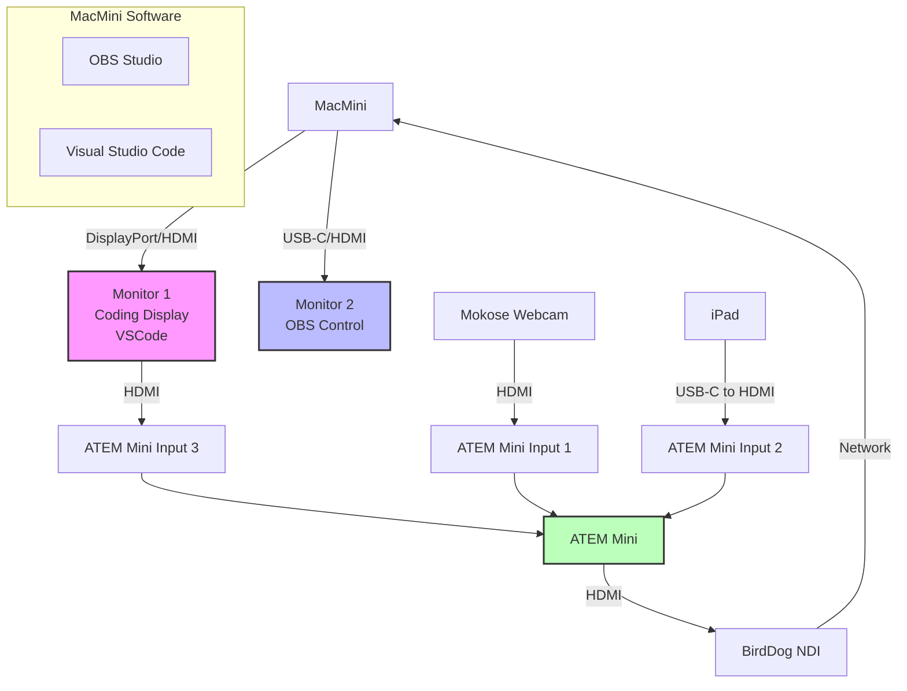

# 1400 - Refactorings

Let me clarify how to connect and configure your monitors in this setup.

Here's the step-by-step setup:

1. **Physical Monitor Setup**
   - Connect Monitor 1 (Coding Display) to MacMini using DisplayPort/HDMI
   - Connect Monitor 2 (OBS Control) to MacMini using USB-C/HDMI
   - Connect Monitor 1's HDMI output to ATEM Mini Input 3

2. **MacMini Display Configuration**
   ```
   System Settings → Displays:
   - Arrange monitors in logical order
   - Set Monitor 1 as your main display
   - Set both monitors to 1080p resolution
   ```

3. **ATEM Mini Connections**
   ```
   Current Setup:
   Input 1: Mokose Webcam
   Input 2: iPad
   Input 3: Coding Monitor (Monitor 1)
   ```

4. **OBS Display Capture Setup**
   ```
   1. Add Source → Display Capture
   2. Properties:
      - Display: Select "Monitor 1"
      - Resolution: 1920x1080
      - Frame Rate: 60
   ```

5. **Visual Studio Code Setup**
   ```
   1. Launch VSCode
   2. Move to Monitor 1
   3. Window → Enter Full Screen
   4. Settings adjustments for streaming:
      - Editor Font Size: 14-16
      - Integrated Terminal Font Size: 14
      - Minimap: Disabled
      - High Contrast Theme
   ```

Key Benefits of This Setup:
1. Dedicated coding monitor that's captured by ATEM
2. Separate OBS control monitor for managing scenes
3. Clean HDMI signal from coding monitor to ATEM

Common Issues and Solutions:

1. **Monitor Not Detected**
   ```
   Check:
   - Cable connections
   - Monitor input source
   - MacMini display settings
   ```

2. **Display Capture Black Screen**
   ```
   Fix:
   - Restart OBS
   - Verify monitor selection
   - Check ATEM input settings
   ```

3. **Resolution Mismatch**
   ```
   Ensure:
   - All devices set to 1080p
   - ATEM input format matches
   - OBS canvas matches resolution
   ```

Would you like me to:
1. Provide specific monitor layout recommendations?
2. Explain how to handle different monitor resolutions?
3. Show how to set up monitor-specific scene compositions?




I'll create a detailed guide for setting up monitor-specific scene compositions in OBS that work well with your multi-monitor setup.

# Monitor-Specific OBS Scene Compositions

## Base Scenes Configuration

### 1. Full Code Scene
```
Name: "Code Full"
Sources (Bottom to Top):
1. Background
   - Color: #1E1E1E (VSCode dark theme)
   - Size: 1920x1080

2. Display Capture (Monitor 1)
   - Capture Settings:
     * Display: Monitor 1 (Coding Display)
     * Method: Windows Graphics Capture
   - Transform:
     * Resize to 1920x1080
     * Position: Center
   
3. Camera Small
   - Size: 320x180
   - Position: Bottom Right
   - Filters:
     * Round Corners: 10px
     * Border: 2px white

Layout Properties:
- No dead zones
- Terminal visible
- File explorer accessible
```

### 2. Split Code and Webcam
```
Name: "Code Split"
Sources:
1. Display Capture (Monitor 1)
   - Transform:
     * Size: 1280x1080
     * Position: Left
   - Crop:
     * Left: 0
     * Right: Adjust to hide unnecessary UI

2. Webcam
   - Transform:
     * Size: 640x1080
     * Position: Right
   - Filters:
     * Border: Left only, 2px white
```

### 3. Code with Drawing Overlay
```
Name: "Code Annotate"
Sources:
1. Display Capture (Monitor 1)
   - Full screen

2. iPad NDI
   - Chroma Key Filter
   - Transform:
     * Size: 1920x1080
     * Position: 0,0

3. Drawing Tools Indicator
   - Text Source
   - Position: Top Right
   - Shows current drawing mode
```

## Advanced Monitor Layouts

### 1. Multi-Panel Development
```
Name: "Dev Layout"
Regions:
1. Main Code (70% left)
   - Display Capture
   - Crop to show only editor

2. Terminal (30% right top)
   - Display Capture
   - Region crop
   - Transform:
     * Size: 576x540
     * Position: 1344,0

3. File Explorer (30% right bottom)
   - Display Capture
   - Region crop
   - Transform:
     * Size: 576x540
     * Position: 1344,540

4. Camera Overlay
   - Size: 320x180
   - Position: Floating
   - Toggle Hotkey: CTRL+C
```

### 2. Tutorial Layout
```
Name: "Tutorial View"
Regions:
1. Code Editor (60%)
   - Left side
   - Crop unnecessary UI

2. Preview/Browser (40% top)
   - Second monitor capture
   - Transform to fit

3. Webcam (40% bottom)
   - Camera source
   - Picture-in-Picture

4. Drawing Layer
   - Full screen overlay
   - Toggle with hotkey
```

### 3. Debug View
```
Name: "Debug Mode"
Layout:
1. Main Debug Window (70%)
   - Display Capture
   - Focus on debug panel

2. Variable Watch (30% right)
   - Region capture
   - Auto-scroll enabled

3. Quick Actions Panel
   - Bottom overlay
   - Shows keyboard shortcuts
```

## Scene Transitions

### Monitor Switch Transitions
```
1. Code → Terminal Focus
   - Move transition
   - Duration: 300ms
   - Ease: In-Out Quad

2. Terminal → Browser
   - Fade transition
   - Duration: 200ms

3. Full Screen Switches
   - Stinger transition
   - Duration: 400ms
```

## Scene Collections

### 1. Development Collection
```
Scenes:
- Code Full
- Split View
- Debug Mode
- Terminal Focus

Quick Switches:
- ALT + 1-4 for scenes
- CTRL + Arrow keys for panels
```

### 2. Tutorial Collection
```
Scenes:
- Code with Camera
- Code with Drawing
- Full Screen Demo
- Q&A Layout

Overlays:
- Lower Third
- Question Display
- Timer
```

## Performance Optimizations

### Per-Scene Settings
```
1. Code Focus Scene
   - Display Capture: 60 FPS
   - High Quality scaling

2. Terminal Scene
   - Display Capture: 30 FPS
   - Performance mode

3. Drawing Scene
   - VSCode: 30 FPS
   - iPad: 60 FPS
```

## Monitor-Specific Filters

### Code Monitor
```
Filters:
1. Sharpen
   - Amount: 0.3
   - Ignore Background

2. Color Correction
   - Contrast: 1.1
   - Brightness: 0.1
   - Saturation: 1.0
```

### Terminal/Output
```
Filters:
1. Text Clarity
   - Sharpen: 0.2
   - Contrast: 1.2

2. Background Dim
   - Opacity: 90%
```

## Hotkey System

```
Global Scene Controls:
- CTRL + 1: Full Code
- CTRL + 2: Split View
- CTRL + 3: Debug View
- CTRL + 4: Tutorial View

Monitor Region Controls:
- ALT + 1: Focus Code
- ALT + 2: Focus Terminal
- ALT + 3: Focus Browser
- ALT + 4: Focus Variables

Quick Actions:
- CTRL + D: Toggle Drawing Mode
- CTRL + C: Toggle Camera
- CTRL + T: Toggle Terminal
- CTRL + B: Toggle Browser
```

Important Tips for Success:
1. Always test scene transitions with actual code on screen
2. Keep VSCode UI consistent across scenes
3. Create scene shortcuts that match your workflow

Would you like me to:
1. Provide specific VSCode settings for each scene type?
2. Create additional specialized layouts for specific development tasks?
3. Explain how to handle high DPI/scaled monitors?


