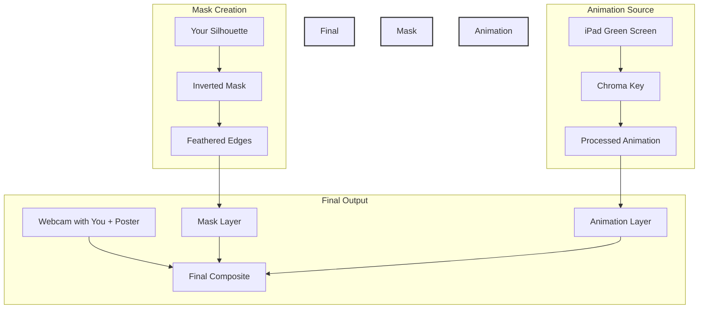

# 900 - Immersive Backgrounds

I have a poster behind me when I am in a web call of the cityscape of New York by night. I am partially blocking the poster as I am between my Mokose web cam and the poster. I want the viewer to see airplanes and lights to appear as if they are part of a real night scene of New York; planes passing by through the sky and building windows emitting light as if people live in them. My idea is to use footage of these airplanes and window lights over a green screen background which I feed into ATEM mini from my iPad. It becomes a source in OBS and I chroma key out the green screen. I then overlay the video over the web cam live stream as if the planes pass by and the windows light up. Is this a working approach or is there a better way? I understand that all video projected will be on top of my face in the web call, only around my upper body it will project on the poster. This is a flaw.

—-

Let me help analyze this creative idea and suggest an improved approach to achieve your dynamic backdrop effect.


This improved approach addresses your concern about the animation appearing on top of you by using a mask. Here's why this solution is better:

1. **Masked Layering:**
   - Creates a mask around your silhouette
   - Animations only appear in the unmasked areas
   - Preserves natural depth perception

2. **Natural Integration:**
   - Animations can appear both in front and behind you
   - Maintains the illusion of depth in the scene
   - Allows for more dynamic movement paths

3. **Technical Benefits:**
   - Lower processing overhead
   - More precise control over effects
   - Better real-time performance

Tips for Implementation:
1. Light animations should match the poster's existing lighting 2. Keep movements subtle to maintain realism 3. Use gradual fade-ins/outs for window effects

Would you like me to:
1. Provide specific animation parameters for realistic plane movements?
2. Detail the mask creation process?
3. Explain how to handle different lighting conditions?

—-



—-

# Dynamic Background Scene with Person Masking

## Scene Structure Setup

### 1. Base Scene Configuration
```
Name: "NYC Dynamic Background"
Canvas: 1920x1080
FPS: 60
```

### 2. Source Layer Order (Bottom to Top) ``` 1. Webcam Source (You + Poster) 2. Person Mask 3. Animation Overlay ```

## Detailed Layer Configuration

### 1. Webcam Source
```
Source Settings:
- Name: "Main Camera"
- Device: Mokose Webcam
- Resolution: 1920x1080
- Frame Rate: 60

Filters:
1. Color Correction
   - Contrast: 1.1
   - Saturation: 1.1
   - Gamma: 1.0
2. Sharpen
   - Amount: 2.0
```

### 2. Person Mask Creation
```
Add Source: "Image Mask Generator"
Settings:
- Mode: Alpha Mask
- Threshold: 40
- Smoothing: 4px
- Feather: 2px

Filters:
1. Chroma Key
   - Type: Custom
   - Similarity: 400
   - Smoothness: 80
2. Mask Blur
   - Type: Gaussian
   - Size: 4
```

### 3. Animation Layer
```
Source: iPad NDI Input
Transform:
- Size: 1920x1080
- Position: Centered

Filters:
1. Chroma Key
   - Key Color: #00FF00
   - Similarity: 400
   - Smoothness: 80
2. Color Correction
   - Gamma: 0.9
   - Brightness: -0.1
```

## Advanced Mask Configuration

### 1. Create Reference Frame
```
1. Position yourself normally
2. Take screenshot
3. Create mask in image editor:
   - Black where you appear
   - White for background
4. Feather edges: 10-20px
```

### 2. Mask Implementation
```
Add Filter to Animation Layer:
1. Image Mask/Blend
   - Path: reference-mask.png
   - Type: Alpha Mask
   - Opacity: 100%
```

## Animation Guidelines

### 1. Plane Animations
```
Design Specifications:
- Flight paths above head height
- Slow, natural movement
- Varying sizes for depth
- Subtle light trails
```

### 2. Building Lights
```
Animation Parameters:
- Random window patterns
- Slow fade transitions
- Warm color temperature
- 30% maximum brightness
```

## Performance Optimization

### 1. Resource Management
```
Priority Settings:
1. OBS: High
2. NDI: Above Normal
3. Animation Playback: Normal
```

### 2. Buffer Settings
```
NDI Source:
- Buffer: 1-2 frames
- Sync: Network
```

—-

# NYC Night Ambience Audio Configuration

## Audio Layer Structure

### 1. Base Ambient Layer
```
Source Name: "NYC-Base-Ambience"
Type: Media Source (Loop)
Content: Urban background noise
- Distant traffic hum
- General city resonance
- Far-off sirens

Settings:
- Volume: 15-20%
- Filter: Low Pass
  * Cutoff: 900Hz
  * Resonance: 0.2
- Monitoring: Monitor and Output
```

### 2. Dynamic Sound Effects
```
Source Name: "NYC-Dynamic-SFX"
Type: Multiple Media Sources

Elements:
1. Airplane Passes
   - Volume: 25-30%
   - Fade In: 3 seconds
   - Fade Out: 4 seconds
   - Doppler effect preset

2. Police Sirens (Distant)
   - Volume: 15%
   - Echo Filter
   - Random timing: Every 3-5 minutes

3. Subway Rumble
   - Volume: 10%
   - Low-pass filter
   - Periodic: Every 4-6 minutes
```

### 3. Building Sounds
```
Source Name: "NYC-Buildings"
Type: Media Source (Loop)

Elements:
1. HVAC Systems
   - Volume: 8%
   - Constant white noise

2. Window AC Units
   - Volume: 5%
   - High-pass filter
```

## Audio Mixer Configuration

### 1. Channel Setup
```
Channel 1: Microphone
- Noise Suppression
- Compressor
- Gain control

Channel 2: NYC-Base-Ambience
- Monitoring enabled
- Stereo spread

Channel 3: NYC-Dynamic-SFX
- Sidechaining with microphone
- Dynamic compression

Channel 4: NYC-Buildings
- Subtle stereo panning
- Low-end rolloff
```

### 2. Filters Per Channel
```
Base Ambience:
- ReaEQ:
  * Low Cut: 100Hz
  * High Cut: 8000Hz
  * Slight boost at 400Hz
- Compressor:
  * Threshold: -24dB
  * Ratio: 2:1
  * Attack: 10ms
  * Release: 100ms

Dynamic SFX:
- Reverb:
  * Room Size: Large
  * Decay: 2.0s
  * Damping: 40%
- Delay:
  * Time: 100ms
  * Feedback: 15%
```

## Scene Integration

### 1. Audio Scene Collection
```
Name: "NYC Night Audio"

Scenes:
1. Full Ambience
   - All layers active

2. Subtle Background
   - Reduced volumes
   - No dynamic effects

3. Meeting Mode
   - Minimal ambience
   - No sudden effects
```

### 2. Transition Settings
```
Audio Crossfade:
- Duration: 2000ms
- Curve: Smooth
- Duck other sources: -12dB
```

## Audio Triggers

### 1. Time-Based Events
```
Regular Intervals:
1. Traffic Surge
   - Every 8-10 minutes
   - Duration: 20 seconds

2. Emergency Vehicles
   - Random: 5-15 minutes
   - Duration: 8-12 seconds

3. Airplane Passes
   - Every 12-15 minutes
   - Duration: 15-20 seconds
```

### 2. Visual Sync Events
```
Linked to Animations:
1. Airplane Sound
   - Sync with visual plane
   - Pan audio with movement

2. Window Sounds
   - Subtle AC hum
   - Random occupied building sounds
```

## Volume Management

### 1. Ducking Setup
```
Primary Voice:
- Threshold: -26dB
- Reduction: -12dB
- Attack: 5ms
- Release: 100ms

Background Reduction:
- Normal: -18dB
- Speaking: -24dB
```

### 2. Safe Ranges
```
Maximum Levels:
- Ambience: -20dB
- Effects: -15dB
- Voice: -12dB

Minimum Levels:
- Ambience: -35dB
- Effects: -30dB
- Voice: -18dB
```

## Quick Controls

### 1. Hotkeys
```
CTRL + 1: Toggle Full Ambience
CTRL + 2: Subtle Mode
CTRL + 3: Meeting Mode
CTRL + M: Mute All Ambience
```

### 2. Emergency Controls
```
Quick Access:
- Master Mute
- Effect Skip
- Volume Reset
```

I'll help you create an immersive New York City night soundscape.

Implementation Tips:

1. **Sound Balance:**
   - Keep ambient sounds subtle enough for clear conversation
   - Use stereo panning for spatial depth
   - Layer sounds gradually

2. **Professional Considerations:**
   - Create a "Quick Mute" for all ambient audio
   - Have a "Meeting Mode" with minimal effects
   - Test all sounds with your normal speaking volume

3. **Technical Setup:**
   - Use high-quality audio samples (minimum 44.1kHz/16-bit)
   - Ensure proper audio sync with animations
   - Monitor CPU usage for smooth performance

Would you like me to:
1. Provide specific sound effect recommendations and sources?
2. Explain how to create custom audio transitions?
3. Detail how to sync audio with specific visual events?

—-


